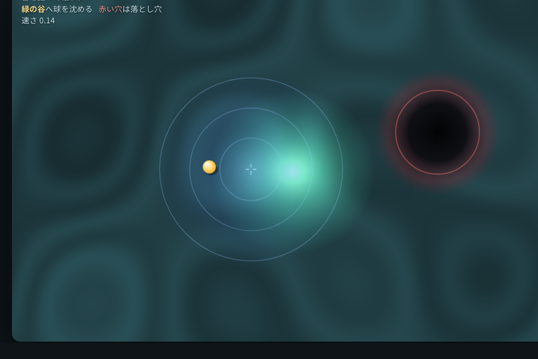

# valley-roll — 谷を掘って転がす

地面を押し窪ませて、転がる球を狙った谷へ導く物理パズル。HTML5 canvas 一枚、依存ゼロ。

## 遊び方

`index.html` をブラウザで開くだけ。

- **マウスを押している間だけ**、カーソル位置の地面が窪む。転がる球はその窪みへ引き寄せられる。
- 指を離すと窪みは消え、球は勢いのまま滑る。
- **緑の谷**に球を沈められれば成功。**赤い穴**(偽の谷)に落ちれば失敗。
- <kbd>R</kbd> でやり直し。

窪ませることが球を動かせる**唯一の手段**。引力なしでは球はその場から動かせない。
窪ませる場所と“指を離す”タイミングで勢いを読み、オーバーシュートさせずに谷へ沈める。

## ひねり

カーソルの地面を押し窪ませ、転がる球をその窪みへ引き寄せる。ルールで縛るのではなく、
「凹ませて引き寄せる」という一個の**加算能力**だけで操作が成立する。

## 発想の種

Dense Associative Memory の自由エネルギー地形(arxiv-cs)。「状態は最寄りの谷へ落ちる」
という描像を、ルールではなく“地面を凹ませて転がる球を引き寄せる”一個の能力に落とした。

## 設計の要:ひねりが荷重を持つこと

「引力なしでは球を全く操れず、窪ませるだけで狙った谷へ確実に導ける」——これが成立して
いなければゲームとして意味がない。谷は**有限リーチのコンパクト台**の窪み(縁の外では力ゼロ)
なので、谷から遠い平地に静止した球は自力で吸い込まれない。動かせるのは窪みだけ。

`verify.mjs` はこの性質をヘッドレス Chrome(CDP)で実測して確かめる:

- 入力なしでは球はほぼ動かず(1200 step ≈ 20秒で ~3px)、長時間(12000 step ≈ 3分)経っても**自力では絶対に谷へ届かない**
- 妥当な窪ませ操作なら目標の谷へ沈められる(勝利)
- 偽の谷は本物の危険——雑にドラッグし続けるとオーバーシュートして落ちる

実行: `node verify.mjs`(Node 18+ / Chrome 必要、追加依存なし)。
